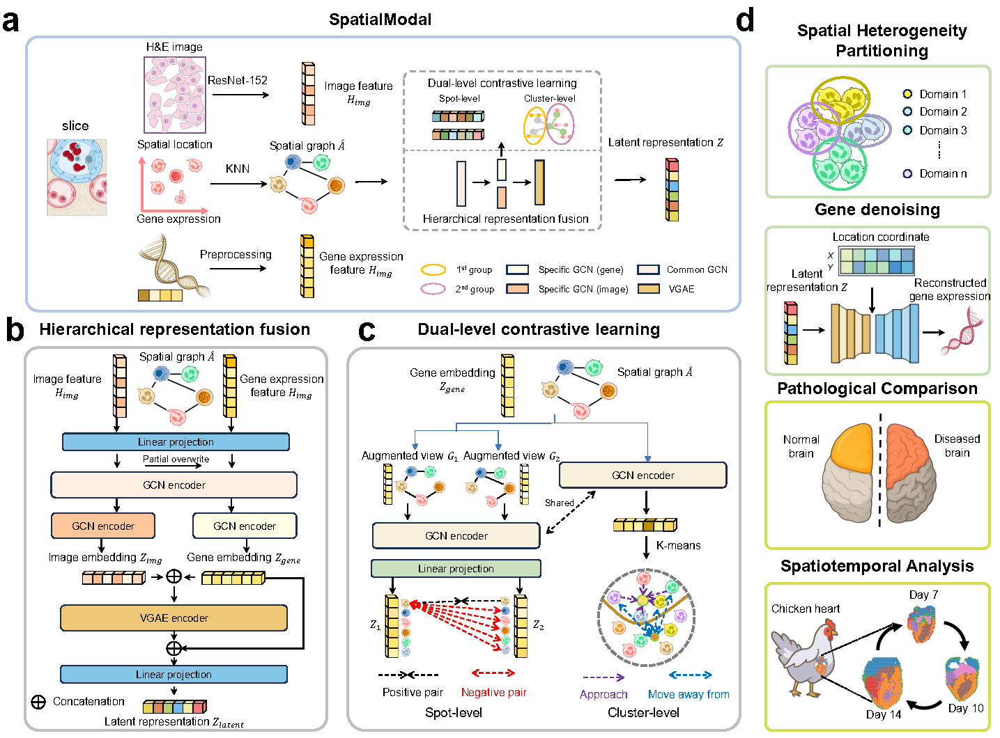

# My-First-Project


## Overview
SpatialModal is an innovative multimodal graph learning framework designed to decipher complex tissue heterogeneity by deeply integrating morphological images and gene expression information from spatial transcriptomics (ST) data. The framework employs a hierarchical encoding strategy combined with a dual-level contrastive learning mechanism to achieve robust alignment and probabilistic fusion of modality-specific and shared biological information within a unified latent space. Extensively validated across diverse ST datasets—including human and mouse brains, human breast cancer, and embryonic heart development—SpatialModal demonstrates superior performance in tasks such as spatial domain identification, gene expression denoising, pathological comparison, and developmental trajectory inference, significantly outperforming current state-of-the-art methods. Furthermore, the model maintains exceptional efficacy and compatibility on platforms lacking histological images (such as MERFISH and Stereo-seq), providing a powerful and versatile analytical platform for exploring the complex spatial mechanisms underlying tissue development and disease.

## Software dependencies
<details close>
<div>python==3.10.15</div>
<div>numpy==2.1.3</div>  
<div>pandas==2.2.3</div>
<div>matplotlib==3.9.3</div>
<div>scanpy==1.10.4</div>
<div>squidpy==1.6.2</div>  
<div>scikit-learn==1.5.2</div>  
<div>scikit-misc==0.5.1</div> 
<div>scipy==1.15.2</div>  
<div>tqdm==4.67.1</div>  
<div>pytorch==2.3.1+cu121</div>   
<div>torch_geometric==2.6.1</div>  
<div>rpy2==3.5.11</div>  
<div>R==3.6.1</div>  
<div>mclust==6.1.1</div>
</details>


## Setup SpatialModal

If you want to manually setup SpatialModal, we recommend you to use [Anaconda](https://docs.anaconda.com/free/anaconda/install/) to build the runtime environment.

1. Clone this repository from Github:
``` bash
git clone https://github.com/xingyili/SpatialModal.git
```

2. Download dataset repository:

``` bash
cd SpatialModal
git submodule update --init --recursive
```

3. Build the Anaconda environment, the package version of the essential dependencies noted at [Software dependencies](#Software-dependencies) section. Or use the `environment.yml` to directly build the conda environment.

``` bash
conda env create -f environment.yml
```

4. Write a python script to run SpatialModal


## Tutorial
Read the [Tutorial](https://github.com/xingyili/SpatialModal/tree/main/Tutorial) for detailed tutorials.  


