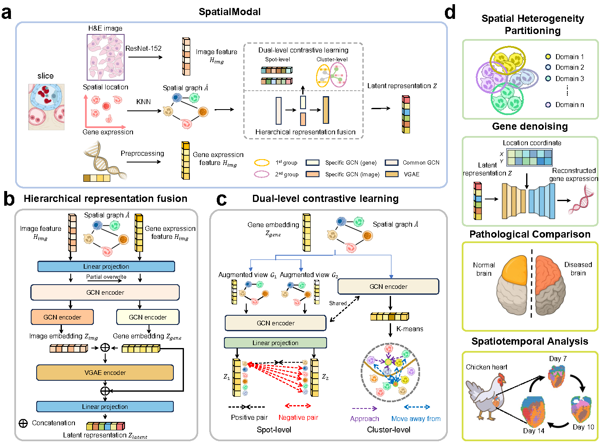

# SpatialModal



## Overview

SpatialModal is a multimodal graph learning framework for spatial transcriptomics analysis. It integrates gene expression, spatial coordinates, and optional histological image features to learn spatially aware latent representations for spatial domain identification and downstream biological interpretation.

This repository provides the source code, representative tutorials, environment file, and data-format instructions needed to reproduce the main SpatialModal workflows.

## Repository Structure

```text
SpatialModal/
├── Data/                  # Example data folder; full datasets are available from Zenodo
├── Spatialmodal/          # Core implementation
│   ├── data_process.py    # Data loading, preprocessing, image feature extraction, graph construction
│   ├── spatialmodal.py    # SpatialModal model and training procedure
│   ├── reconstruction.py  # Gene expression reconstruction utilities
│   └── utils.py           # Clustering and visualization utilities
├── Tutorial/              # Step-by-step notebooks for representative datasets
├── environment.yml        # Conda environment
└── README.md
```

The data used in the tutorials are available at:

```text
https://doi.org/10.5281/zenodo.18220735
```

## Installation

We recommend using Anaconda or Miniconda.

```bash
git clone https://github.com/xingyili/SpatialModal.git
cd SpatialModal
conda env create -f environment.yml
conda activate SpatialModal
```

If the environment name in `environment.yml` is different on your system, activate the corresponding conda environment before running the tutorials.

## Input Data Format

SpatialModal supports both 10x Visium-style directories and preprocessed `AnnData` objects.

### 10x Visium Directory

For Visium data, each sample folder should follow the standard Space Ranger structure:

```text
Data/
└── sample_name/
    ├── filtered_feature_bc_matrix.h5
    ├── spatial/
    │   ├── tissue_positions_list.csv
    │   ├── tissue_hires_image.png
    │   ├── tissue_lowres_image.png
    │   └── scalefactors_json.json
    ├── image_feat.csv          # Optional: precomputed image features
    └── sample_name_truth.txt   # Optional: ground-truth labels for evaluation
```

The data can be loaded with:

```python
from Spatialmodal.data_process import load_ST_file

fold = "./Data/151674"
adata = load_ST_file(fold)
```

If `image_feat.csv` is already available, set `image_use=True` and `if_img=False` when initializing SpatialModal. If image features need to be extracted from the histology image, set both `image_use=True` and `if_img=True`.

### AnnData Input

For non-Visium platforms or custom data, SpatialModal expects an `AnnData` object with:

```text
adata.X or adata.layers     Gene expression matrix
adata.obsm["spatial"]      Spatial coordinates, shape = n_spots x 2
adata.obsm["feat"]         Optional preprocessed gene features
adata.obsm["image_representation"] Optional image/morphology features
adata.obs["ground_truth"]  Optional labels for ARI/NMI evaluation
```

If `adata.obsm["feat"]` is absent, SpatialModal performs standard preprocessing and selects highly variable genes. If `adata.obsm["image_representation"]` is absent and image features are not used, gene features are used as the second modality for compatibility with platforms without histological images.

## Quick Start

The following example runs SpatialModal on a Visium sample with precomputed or extractable histology features.

```python
import torch
import pandas as pd
from Spatialmodal.spatialmodal import SpatialModal
from Spatialmodal.data_process import load_ST_file
from Spatialmodal.utils import clustering

sample = "151674"
fold = f"./Data/{sample}"
device = torch.device("cuda:0" if torch.cuda.is_available() else "cpu")

adata = load_ST_file(fold)

# Optional: load ground-truth labels for evaluation.
truth = pd.read_csv(f"{fold}/{sample}_truth.txt", sep="\t", header=None, index_col=0)
adata.obs["ground_truth"] = truth.reindex(adata.obs_names)[truth.columns[0]]
adata = adata[~pd.isnull(adata.obs["ground_truth"])].copy()
n_clusters = adata.obs["ground_truth"].nunique()

model = SpatialModal(
    adata,
    device=device,
    epochs=1000,
    fold=fold,
    image_use=True,
    if_img=True,
)
adata = model.train()

# Cluster the learned embedding for spatial domain identification.
adata = clustering(adata, n_clusters=n_clusters, key="emb", add_key="SpatialModal")
```

The learned representation is stored in:

```python
adata.obsm["emb"]
```

The reconstructed gene expression is stored in:

```python
adata.obsm["rec_gene"]
```

## Key Parameters

| Parameter | Default | Description |
|---|---:|---|
| `device` | `cuda` if available | Device used for model training. |
| `epochs` | 1000 | Number of training epochs. |
| `learning_rate` | 0.001 | Learning rate for AdamW. |
| `weight_decay` | 0.001 | Weight decay for AdamW. |
| `random_seed` | 2026 | Random seed for reproducibility. |
| `fold` | `""` | Path to the sample folder. Required when image features are loaded or extracted. |
| `image_use` | `False` | Whether to use histological image features. |
| `if_img` | `False` | Whether to extract image features from raw histology images. If `False`, SpatialModal reads `image_feat.csv` when `image_use=True`. |
| `img_size` | 80 | Crop size around each spot for image feature extraction. |
| `target_size` | 299 | Input image size for the ResNet image encoder. |
| `modals` | `"2D"` | Use built-in 2D spatial graph construction. |
| `graph` | `None` | Optional user-provided graph when `modals` is not `"2D"`. |

Important model hyperparameters used in the released implementation include:

| Module | Hyperparameter | Default |
|---|---|---:|
| Spatial graph | Number of nearest neighbors | 6 |
| Feature projection | Projected dimension | 512 |
| Hierarchical representation | Fusion dimension | 128 |
| Cross-modal perturbation | Perturbation ratio | 0.3 |
| VGAE | Latent dimension | 16 |
| Spot-level contrastive learning | Edge dropping rates | 0.1, 0.05 |
| Spot-level contrastive learning | Feature masking rates | 0.2, 0.1 |
| Spot-level contrastive learning | Temperature | 0.4 |
| Cluster-level contrastive learning | Number of prototypes | 2 |
| Loss function | Global reconstruction weight | 1 |
| Loss function | Mask reconstruction weight | 10 |
| Loss function | VGAE graph/KLD weights | 1, 1 |
| Loss function | Spot- and cluster-level contrastive weights | 0.01, 1 |

## Tutorials

Detailed examples are provided in the `Tutorial/` directory:

| Notebook | Dataset / workflow |
|---|---|
| `DLPFC.ipynb` | 10x Visium human dorsolateral prefrontal cortex analysis |
| `Breast_Cancer.ipynb` | Human breast cancer spatial domain analysis |
| `Mouse_Brain.ipynb` | Mouse brain spatial transcriptomics analysis |
| `Chicken_Heart.ipynb` | Chicken heart developmental analysis |
| `MTG.ipynb` | Human middle temporal gyrus analysis |

See `Tutorial/README.md` for additional details on data organization, expected inputs, and common parameter settings.

## Outputs

After training, SpatialModal returns the input `AnnData` object with additional fields:

| Field | Description |
|---|---|
| `adata.obsm["emb"]` | SpatialModal latent embedding used for clustering and visualization. |
| `adata.obsm["rec_gene"]` | Reconstructed gene expression representation. |
| `adata.obs["SpatialModal"]` | Spatial domain labels, if the clustering utility is applied. |

## Reproducibility Notes

Set `random_seed` to a fixed value for reproducible model initialization and training. For Visium data, use the same `image_feat.csv` file or the same image extraction settings (`img_size`, `target_size`, and `if_img=True`) to reproduce image-derived features.
